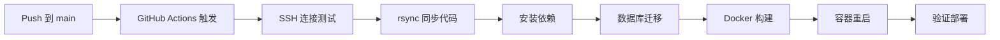

# RankSheet.com 部署总结

本文档总结 RankSheet.com 项目的完整部署配置，包括前端（Cloudflare Pages）和后端（VPS Docker）的自动化 CI/CD 流程。

---

## 📋 项目概览

| 组件 | 技术栈 | 部署平台 | 域名 | 状态 |
|------|--------|---------|------|------|
| **前端 Web** | Next.js 15.5 + OpenNext | Cloudflare Pages | ranksheet.com | ✅ 已配置 |
| **后端 CMS** | Payload 3.68 + Postgres | VPS Docker | cms.ranksheet.com | ✅ 已部署 |
| **共享包** | TypeScript + Zod | - | - | ✅ 本地构建 |

---

## 🏗️ 架构图

```
┌─────────────────────────────────────────────────────────────┐
│                    GitHub Repository                         │
│                  affiliateberry/ranksheet.com                │
└─────────────────────┬───────────────────────────────────────┘
                      │
        ┌─────────────┴─────────────┐
        │                           │
        ▼                           ▼
┌───────────────┐           ┌───────────────┐
│ Push: apps/web│           │ Push: apps/cms│
│               │           │               │
│ GitHub Actions│           │ GitHub Actions│
│ deploy-web.yml│           │ deploy-cms.yml│
└───────┬───────┘           └───────┬───────┘
        │                           │
        ▼                           ▼
┌───────────────────┐       ┌───────────────────┐
│ Cloudflare Pages  │       │  VPS Docker       │
│                   │       │  107.174.42.198   │
│ OpenNext Worker   │◄──────┤  Payload CMS      │
│ Edge Caching      │  API  │  Postgres         │
│                   │       │  Redis            │
└───────────────────┘       └───────────────────┘
        │                           │
        └─────────┬─────────────────┘
                  │
                  ▼
          ┌───────────────┐
          │   End Users   │
          └───────────────┘
```

---

## ✅ 已完成的配置

### 1. 安全配置（防止密钥泄露）

#### wrangler 配置
- ✅ `apps/web/wrangler.jsonc.example` - 公开模板（使用占位符）
- ✅ `apps/web/wrangler.jsonc` - 本地配置（已被 git 忽略）
- ✅ `.gitignore` - 排除所有敏感文件

#### 安全验证
- ✅ `apps/web/scripts/verify-security.sh` - 自动安全检查脚本
- ✅ 验证无硬编码密钥
- ✅ 验证 .gitignore 配置正确

### 2. GitHub Actions Workflows

创建了 4 个 GitHub Actions workflows：

| Workflow | 文件 | 触发条件 | 用途 |
|----------|------|---------|------|
| **前端部署** | `.github/workflows/deploy-web.yml` | 推送到 `apps/web/**` | 部署到 Cloudflare Pages |
| **后端部署** | `.github/workflows/deploy-cms.yml` | 推送到 `apps/cms/**` | 部署到 VPS Docker |
| **CI 检查** | `.github/workflows/ci.yml` | PR/Push | Lint + Test + Security Audit |
| **Docker 安全** | `.github/workflows/docker-security.yml` | PR/Push | Docker 镜像安全扫描 |

### 3. 文档

创建了完整的部署文档：

| 文档 | 路径 | 用途 |
|------|------|------|
| **GitHub Secrets 配置** | `GITHUB_SECRETS.md` | 详细说明如何配置所有必需的 Secrets |
| **前端部署指南** | `apps/web/DEPLOYMENT.md` | 前端本地和 CI/CD 部署步骤 |
| **快速开始** | `apps/web/QUICKSTART.md` | 5 分钟快速部署 |
| **安全检查清单** | `apps/web/SECURITY_CHECKLIST.md` | 部署前安全验证 |
| **配置总结** | `apps/web/CONFIGURATION_SUMMARY.md` | 完整配置说明 |
| **部署总结** | `DEPLOYMENT_SUMMARY.md` | 本文档 |

---

## 🔐 需要的 GitHub Secrets

### 前端部署 (4 个)

```bash
CLOUDFLARE_ACCOUNT_ID=your-cloudflare-account-id
CLOUDFLARE_API_TOKEN=your-cloudflare-api-token
CMS_PUBLIC_URL=https://cms.ranksheet.com
SITE_URL=https://ranksheet.com
```

### 后端部署 (4 个)

```bash
VPS_SSH_HOST=107.174.42.198
VPS_SSH_USER=root
VPS_SSH_KEY=<SSH 私钥内容>
VPS_DEPLOY_PATH=/opt/docker-projects/payload-clusters/payload-cms/ranksheet/ranksheet.com
```

详细配置步骤请查看：[GITHUB_SECRETS.md](GITHUB_SECRETS.md)

---

## 🚀 部署流程

### 前端部署流程 (Cloudflare Pages)


**步骤详解**:
1. 代码推送到 `main` 分支（`apps/web/**` 路径变更）
2. GitHub Actions 自动触发 `deploy-web.yml`
3. 运行 `verify-security.sh` 验证无密钥泄露
4. 安装 pnpm 依赖
5. 构建 `@ranksheet/shared` 包
6. TypeScript 类型检查 + ESLint
7. 使用 OpenNext 构建 Cloudflare 兼容版本
8. 使用 wrangler 部署到 Cloudflare Pages
9. 生成部署摘要报告

**预计时间**: 5-8 分钟

### 后端部署流程 (VPS Docker)



**步骤详解**:
1. 代码推送到 `main` 分支（`apps/cms/**` 路径变更）
2. GitHub Actions 自动触发 `deploy-cms.yml`
3. 使用 SSH 私钥连接到 VPS
4. 通过 rsync 同步代码（排除 node_modules/.next/.git）
5. 在 VPS 上安装依赖并构建 shared 包
6. 运行数据库迁移（`pnpm db:migrate`）
7. 使用 `make deploy` 重新构建 Docker 镜像
8. 重启容器（zero-downtime）
9. 验证容器运行状态

**预计时间**: 8-12 分钟

---

## 📦 手动部署（本地）

### 前端手动部署

```bash
# 1. 进入前端目录
cd apps/web

# 2. 创建本地 wrangler 配置
cp wrangler.jsonc.example wrangler.jsonc
# 编辑 wrangler.jsonc，填入真实的 account_id

# 3. 构建
pnpm cf:build

# 4. 部署
pnpm cf:deploy
# 或使用 wrangler
npx wrangler pages deploy .open-next/worker --project-name=ranksheet
```

### 后端手动部署

```bash
# 1. 同步代码到 VPS
rsync -avz --delete \
  --exclude='node_modules' --exclude='.next' --exclude='.git' \
  ./ root@107.174.42.198:/opt/docker-projects/payload-clusters/payload-cms/ranksheet/ranksheet.com/

# 2. SSH 到 VPS
ssh root@107.174.42.198

# 3. 进入项目目录
cd /opt/docker-projects/payload-clusters/payload-cms/ranksheet/ranksheet.com

# 4. 安装依赖
pnpm install

# 5. 运行迁移
cd apps/cms && pnpm db:migrate && cd ../..

# 6. 部署 Docker
cd apps/cms && make deploy
```

---

## 🔍 验证部署

### 前端验证

```bash
# 检查网站可访问性
curl -I https://ranksheet.com

# 检查 API 代理
curl https://ranksheet.com/api/sheet-trends
```

### 后端验证

```bash
# SSH 到 VPS 检查容器状态
ssh root@107.174.42.198
cd /opt/docker-projects/payload-clusters/payload-cms/ranksheet/ranksheet.com/apps/cms
docker compose -f docker-compose.prod.yml ps

# 检查 CMS API
curl https://cms.ranksheet.com/api/public/keywords

# 查看日志
docker logs ranksheet-cms --tail 50
```

---

## 🛠️ 故障排查

### 前端部署失败

**常见问题**:

1. **Cloudflare 认证失败**
   ```
   Error: Authentication error
   ```
   - 检查 `CLOUDFLARE_API_TOKEN` 是否正确
   - 验证 Token 权限包含 "Cloudflare Pages (Edit)"

2. **构建失败**
   ```
   Error: Type check failed
   ```
   - 本地运行 `pnpm typecheck` 修复类型错误
   - 确保 `@ranksheet/shared` 包已构建

3. **环境变量缺失**
   ```
   Error: CMS_PUBLIC_URL is not defined
   ```
   - 检查 GitHub Secrets 是否配置完整

### 后端部署失败

**常见问题**:

1. **SSH 连接失败**
   ```
   Permission denied (publickey)
   ```
   - 验证 `VPS_SSH_KEY` 包含完整私钥
   - 确认公钥已添加到 VPS: `cat ~/.ssh/authorized_keys`

2. **rsync 失败**
   ```
   rsync: connection unexpectedly closed
   ```
   - 检查 VPS 防火墙是否允许 GitHub Actions IP
   - 验证 `VPS_DEPLOY_PATH` 路径存在

3. **Docker 构建失败**
   ```
   Error: make deploy failed
   ```
   - SSH 到 VPS 查看详细日志
   - 检查 `.env` 文件是否完整
   - 验证数据库连接

---

## 📊 部署监控

### GitHub Actions

- 访问: https://github.com/affiliateberry/ranksheet.com/actions
- 查看每次部署的状态和日志
- 失败时会在 Summary 中显示错误信息

### Cloudflare Dashboard

- 访问: https://dash.cloudflare.com
- Pages → ranksheet 项目
- 查看部署历史、访问统计、错误日志

### VPS 监控

```bash
# 容器状态
docker ps | grep ranksheet

# 实时日志
docker logs ranksheet-cms -f --tail 100

# 资源使用
docker stats ranksheet-cms

# 数据库连接
docker exec ranksheet-cms-postgres psql -U postgres -c "\dt ranksheet.*"
```

---

## 🔄 回滚策略

### 前端回滚

Cloudflare Pages 保留历史部署版本：

1. 访问 Cloudflare Dashboard
2. Pages → ranksheet → Deployments
3. 选择之前的稳定版本
4. 点击 "Rollback to this deployment"

或使用 Git 回滚：
```bash
git revert <commit-hash>
git push origin main
```

### 后端回滚

使用 Git 回滚并重新部署：

```bash
# 1. 回滚代码
git revert <commit-hash>
git push origin main

# 2. 等待 GitHub Actions 自动部署
# 或手动 SSH 到 VPS 执行
ssh root@107.174.42.198
cd /opt/docker-projects/payload-clusters/payload-cms/ranksheet/ranksheet.com/apps/cms
make down && make deploy
```

---

## 🔐 安全检查清单

在首次部署前，请完成以下检查：

- [ ] 运行 `bash apps/web/scripts/verify-security.sh` 通过
- [ ] 所有 GitHub Secrets 已配置
- [ ] wrangler.jsonc 已被 .gitignore 排除
- [ ] .env 文件未提交到 git
- [ ] SSH 私钥使用专用密钥对（非个人密钥）
- [ ] Cloudflare API Token 权限最小化
- [ ] VPS 防火墙已配置（仅允许必要端口）
- [ ] 数据库连接使用 SSL（Supabase 默认启用）

---

## 📚 相关资源

### 文档
- [GITHUB_SECRETS.md](GITHUB_SECRETS.md) - GitHub Secrets 配置详解
- [apps/web/DEPLOYMENT.md](apps/web/DEPLOYMENT.md) - 前端部署指南
- [apps/web/QUICKSTART.md](apps/web/QUICKSTART.md) - 快速开始
- [apps/cms/README.md](apps/cms/README.md) - 后端开发指南

### 配置文件
- [.github/workflows/deploy-web.yml](.github/workflows/deploy-web.yml)
- [.github/workflows/deploy-cms.yml](.github/workflows/deploy-cms.yml)
- [apps/web/wrangler.jsonc.example](apps/web/wrangler.jsonc.example)
- [apps/cms/docker-compose.prod.yml](apps/cms/docker-compose.prod.yml)

### 外部资源
- [Cloudflare Pages Docs](https://developers.cloudflare.com/pages/)
- [Payload CMS Docs](https://payloadcms.com/docs)
- [OpenNext Docs](https://opennext.js.org/)
- [GitHub Actions Docs](https://docs.github.com/en/actions)

---

## 🎯 下一步

1. **配置 GitHub Secrets**
   - 按照 [GITHUB_SECRETS.md](GITHUB_SECRETS.md) 配置所有必需的 Secrets

2. **初始化 Git 仓库**
   ```bash
   git init
   git add .
   git commit -m "Initial commit with CI/CD configuration"
   git remote add origin https://github.com/affiliateberry/ranksheet.com.git
   git push -u origin main
   ```

3. **首次部署**
   - 推送代码后，GitHub Actions 将自动触发部署
   - 或在 Actions 页面手动触发 workflow

4. **配置域名 DNS**
   - 前端: `ranksheet.com` → Cloudflare Pages CNAME
   - 后端: `cms.ranksheet.com` → 107.174.42.198 A 记录（已配置）

5. **监控和优化**
   - 启用 Cloudflare Analytics
   - 配置错误追踪（Sentry）
   - 设置性能监控

---

**部署配置完成时间**: 2024-12-22
**维护者**: affiliateberry
**状态**: ✅ 生产就绪
